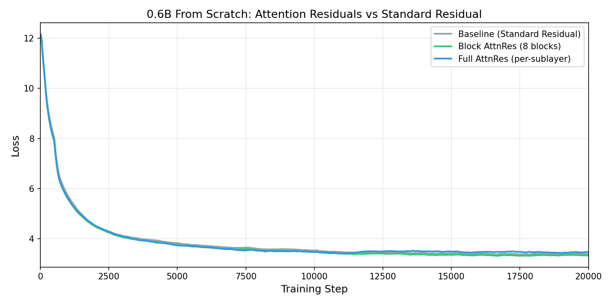

# Open Attention Residuals

An open-source implementation of [Attention Residuals](https://arxiv.org/abs/2603.15031) (Kimi Team, 2025) — replacing standard additive residual connections with learned softmax attention over previous sublayer outputs.

<p align="center">
  
</p>

## Key Results

### 0.6B Model (d=1024, L=28, same as Qwen3-0.6B, 20k steps)

| Model | Train Loss | WikiText-2 PPL | LAMBADA Acc | HellaSwag Acc |
|-------|-----------|----------------|-------------|---------------|
| Baseline (Standard Residual) | 3.303 | 60.21 | 0.082 | 0.325 |
| **Attention Residuals** | **3.350** | **55.69** | **0.114** | **0.340** |

For reference, the pretrained Qwen3-0.6B (15T tokens) achieves PPL 20.97, LAMBADA 0.364, HellaSwag 0.410.

## How It Works

Standard transformers use additive residual connections:
```
h_l = h_{l-1} + f_{l-1}(h_{l-1})
```

**Attention Residuals** (Eq. 1 of the paper) replace this with learned depth-wise attention over individual sublayer outputs:

```
h_l = Σ α_{i→l} · v_i
```

where `v_i = f_i(h_i)` is the output of sublayer `i` (not the cumulative state), and `α_{i→l}` are softmax attention weights computed with a per-layer learned query vector.

```python
def attn_res(deltas, partial_block, proj, norm):
    """Attend over previous sublayer outputs and add to residual stream."""
    V = torch.stack(deltas)                        # (N, B, T, D)
    K = norm(V)                                     # RMSNorm keys
    query = proj.weight.view(-1)                    # learned query (D,)
    logits = einsum("d, n b t d -> n b t", query, K)
    weights = softmax(logits, dim=0)                # (N, B, T)
    selected = einsum("n b t, n b t d -> b t d", weights, V)
    return partial_block + selected                 # add to residual stream
```

Each sublayer selectively retrieves information from any previous sublayer's output — "which previous layer's *change* should I re-use?"

### Block AttnRes Variant

The paper also proposes **Block AttnRes**, which groups layers into N blocks and sums sublayer outputs within each block before applying cross-block attention. This reduces memory from O(L×d) to O(N×d).

### Layer Dependency Visualization

<p align="center">
  <b>AttnRes (paper, per-sublayer, 0.6B trained from scratch)</b><br>
  
</p>

The visualization shows each sublayer's attention weights over previous sublayer outputs. The model learns genuine cross-layer routing patterns — selectively attending to specific earlier layers, not just the most recent one.

## Modes

| Mode | Config | Sources | Description |
|------|--------|---------|-------------|
| **`delta`** (paper default) | `attnres_mode="delta"` | Per-sublayer outputs `f_i(h_i)` | Original paper formulation (Eq. 3-4) |
| `block` | `attnres_mode="block"` | Block-level sums | Groups layers into N blocks |
| `full` | `attnres_mode="full"` | Cumulative states | Variant: attend over cumulative residual stream |

## Quick Start

### Install
```bash
pip install -r requirements.txt
```

### Train from Scratch
```bash
# Baseline
torchrun --nproc_per_node=8 train.py --mode baseline

# AttnRes (paper formulation, recommended)
torchrun --nproc_per_node=8 train.py --mode delta

# Block AttnRes
torchrun --nproc_per_node=8 train.py --mode block --num_blocks 4
```

### Evaluate
```bash
python eval.py --model_path output/scratch-delta-d512-L12-20k/final --mode delta
```

### Interactive Visualization
```bash
python app.py --model_path output/scratch-delta-d512-L12-20k/final --mode delta
```

## Model Architecture

```
100M: d=512, L=12, heads=8, kv_heads=4, ff=1536
0.6B: d=1024, L=28, heads=16, kv_heads=8, ff=3072 (same as Qwen3-0.6B)
```

AttnRes adds per layer:
- 2× projection vectors (`res_proj`, d-dimensional, zero-initialized)
- 2× RMSNorm layers (`res_norm`)

Total overhead: **0.03% parameters**, **<2% latency**.

## Pretrained Weights

| Model | Mode | Link |
|-------|------|------|
| 100M Baseline | — | [wdlctc/open-attnres-baseline](https://huggingface.co/wdlctc/open-attnres-baseline) |
| 100M Block AttnRes | 4 blocks | [wdlctc/open-attnres-block](https://huggingface.co/wdlctc/open-attnres-block) |
| 0.6B Baseline | — | [wdlctc/open-attnres-0.6b-baseline](https://huggingface.co/wdlctc/open-attnres-0.6b-baseline) |
| 0.6B Block AttnRes | 8 blocks | [wdlctc/open-attnres-0.6b-block](https://huggingface.co/wdlctc/open-attnres-0.6b-block) |

## Findings

1. **AttnRes (paper formulation) has the smoothest training dynamics.** Per-sublayer outputs are naturally distinctive, giving the softmax clean gradients. Cumulative-state variants suffer from source redundancy (cos sim ~0.95 between adjacent sources).

2. **Block mode has lower training loss but AttnRes (paper) wins on downstream evals.** At 0.6B scale, the paper formulation achieves the best LAMBADA (0.114) and HellaSwag (0.340) despite higher training loss.

3. **Train from scratch for maximum benefit.** Fine-tuning pretrained models yields small gains (~0.02 loss) because pretrained weights are committed to standard residual flow.

4. **Zero-init queries work best.** The paper's default initialization (all projection weights = 0 → uniform softmax) outperforms all alternatives we tried.

## Citation

```bibtex
@software{luo2025openattnres,
  title={Open Attention Residuals},
  author={Cheng Luo and Zefan Cai},
  url={https://github.com/wdlctc/open-attention-residuals},
  year={2025}
}

@article{kimi2025attention,
  title={Attention Residuals},
  author={Kimi Team},
  journal={arXiv preprint arXiv:2603.15031},
  year={2025}
}
```

## Acknowledgments

- [Attention Residuals](https://arxiv.org/abs/2603.15031) — Kimi Team (original paper)
- [Qwen3](https://arxiv.org/abs/2505.09388) — Qwen Team (base architecture)
